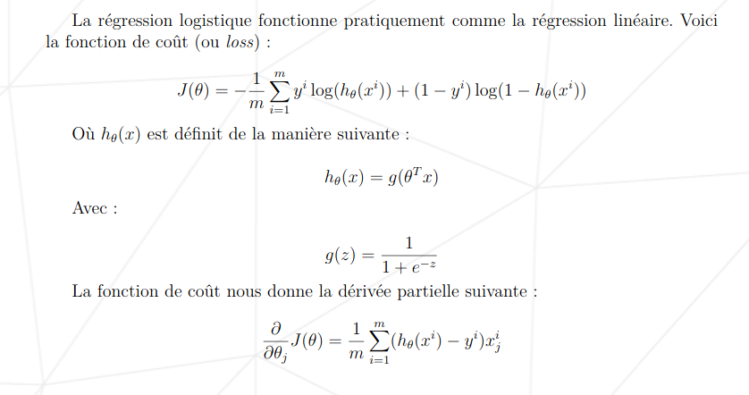

# DSLR

> Dans ce projet *DataScience x Logistic Regression*, vous allez poursuivre votre explo-ration duMachine Learningen ajoutant divers outils à votre escarcelle.
>
> Vous implémenterez un modèle de classification linéaire, dans la continuité du sujetlinear regression: unelogistic regression. Nous vous encourageons d’ailleurs beaucoup àvous créer une bibliothèque demachine learningau fur et à mesure que vous avancerezdans la branche.
>
> En somme :
> - Vous apprendrez à lire un jeu de données, à le visualiser de différentes manières,à sélectionner et nettoyer vos données.
> - Vous mettrez en place une régression logistique qui vous permettra de résoudredes problèmes de classification.

## Data Analysis

> Dans cette partie, le professeur McGonagall vous demande de produire un programmenommédescribe.[extension]. Ce programme prendra undataseten paramètre. Ildevra ni plus ni moins afficher les informations sur toutes lesfeaturesnumériques

```
./describe.py -h
usage: describe.py [-h] [-f FILE]

describe some data

optional arguments:
  -h, --help            show this help message and exit
  -f FILE, --file FILE  input data file
```

```
./describe.py 
           Index   Arithmancy  Astronomy  Herbology  ...    Potions Care of Magical Creatures     Charms     Flying
count 1600.00000   1566.00000 1568.00000 1567.00000  ... 1570.00000                1560.00000 1600.00000 1600.00000
mean   799.50000  49634.57024   39.79713    1.14102  ...    5.95037                  -0.05343 -243.37441   21.95801
std    462.02453  16679.80604  520.29827    5.21968  ...    3.14785                   0.97146    8.78364   97.63160
min            0 -24370.00000 -966.74055  -10.29566  ...   -4.69748                  -3.31368 -261.04892 -181.47000
25%          400  38510.00000 -489.49378   -4.31212  ...    3.64490                  -0.67100 -250.64727  -41.84000
50%          800  49018.00000  261.64473    3.46901  ...    5.87758                  -0.04330 -244.86751   -2.51000
75%         1200  60828.00000  525.90954    5.42105  ...    8.24879                   0.59445 -232.53675   50.89000
max         1599 104956.00000 1016.21194   11.61290  ...   13.53676                   3.05655 -225.42814  279.07000
```

## Data Visualization

### Histogram

> Faites un script nommé histogram.[extension]qui affiche un histogram répondant à la question suivante :
>
> Quel cours de Poudlard a une répartition des notes homogènes entre les quatres maisons ?

```
./histogram.py -h
usage: histogram.py [-h] [-f FILE]

Quel cours de Poudlard a une répartition des notes homogènes entre les quatres maisons ?

optional arguments:
  -h, --help            show this help message and exit
  -f FILE, --file FILE  input data file
```


### Scatter plot

> Faites un script nommé scatter_plot.[extension]qui affiche un scatter plot répondant à la question suivante :
>
> Quelles sont les deux features qui sont semblables ?

```
./scatter_plot.py -h
usage: scatter_plot.py [-h] [-f FILE]

Quel cours de Poudlard a une répartition des notes homogènes entre les quatres maisons ?

optional arguments:
  -h, --help            show this help message and exit
  -f FILE, --file FILE  input data file
```


### Pair plot

> Faites un script nommé pair_plot.[extension] qui affiche un pair plot ou scatterplot matrix(selon la librairie graphique que vous utiliserez).
>
> À partir de cette visualisation, quelles caractéristiques allez-vous utiliser pour entraîner votre prochaine régression logistique ?

```
./pair_plot.py -h                           
usage: pair_plot.py [-h] [-f FILE]

Quel cours de Poudlard a une répartition des notes homogènes entre les quatres maisons ?

optional arguments:
  -h, --help            show this help message and exit
  -f FILE, --file FILE  input data file
```


## Logistic Regression

> Vous arrivez à la dernière partie : coder votre Choixpeau magique. Pour ce faire, il vous est demandé de réaliser un multi-classifieur en utilisant une régression logistique en one-vs-all.
>
> Vous devrez rendre deux programmes :
> - un premier qui va train vos modèles. Il prend en paramètre dataset_train.csv. Vous devez utilisez la technique du gradient descent pour minimiser l’erreur.
> - un second qui se nomme logreg_predict.[extension]



### Training

```
./logreg_train.py -h
usage: logreg_train.py [-h] [-i INPUT] [-o OUTPUT] [-H] [-l LEARNINGRATE] [-r RANGE]

Logistic Regression train program, using gradient descent

optional arguments:
  -h, --help            show this help message and exit
  -i INPUT, --input INPUT
                        input data file
  -o OUTPUT, --output OUTPUT
                        output thetas file
  -H, --history         show history plot
  -l LEARNINGRATE, --learningrate LEARNINGRATE
                        learning rate for training
  -r RANGE, --range RANGE
                        training range for training (epochs)
```

### Predict

```
./logreg_predict.py -h
usage: logreg_predict.py [-h] [-d DATAFILE] [-t THETAFILE] [-o OUTPUT] [-s]

Logistic Regression predicter program Using a trained thetas csv file, generated with the logreg_train program

optional arguments:
  -h, --help            show this help message and exit
  -d DATAFILE, --datafile DATAFILE
                        input data file
  -t THETAFILE, --thetafile THETAFILE
                        output theta file
  -o OUTPUT, --output OUTPUT
                        output houses file
  -s, --show            show logistic regression
```

## Resources

https://towardsdatascience.com/multi-class-classification-one-vs-all-one-vs-one-94daed32a87b

https://utkuufuk.com/2018/06/03/one-vs-all-classification/

https://fr.wikipedia.org/wiki/Sigmo%C3%AFde_(math%C3%A9matiques)

https://fr.wikipedia.org/wiki/R%C3%A9gression_logistique
